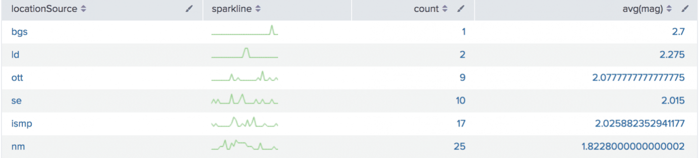

# SPL Power

## Using Transforming Commands for Visualizations

&#x20; 1\.  Chart Command&#x20;

2. TimeChart Command

### 1. Chart Command

The `chart` command is a [transforming command](https://docs.splunk.com/Splexicon:Transformingcommand) that returns your results in a table format. The results can then be used to display the data as a chart, such as a column, line, area, or pie chart.

&#x20; **Chart options**

<table data-full-width="true"><thead><tr><th width="157">Chart Options</th><th width="92">b / i / s</th><th width="89">Default </th><th>Description</th></tr></thead><tbody><tr><td>cont</td><td>bool</td><td>true</td><td>Specifies if the bins are continuous. If cont=false, replots the x-axis so that a noncontinuous sequence of x-value bins show up adjacently in the output. If cont=true, bins that have no values will display with a count of 0 or null values.</td></tr><tr><td>format</td><td>str</td><td>Na</td><td>Used to construct output field names when multiple data series are used in conjunction with a split-by-field. <code>format</code> takes precedence over <code>sep</code> and allows you to specify a parameterized expression with the stats aggregator and function ($AGG$) and the value of the split-by-field ($VAL$).</td></tr><tr><td>limit</td><td>init</td><td>10</td><td>Only valid when a column-split is specified. Use the <code>limit</code> option to specify the number of results that should appear in the output. When you set <code>limit=N</code> the top or bottom N values are retained, based on the sum of each series and the prefix you have selected. If <code>limit=0</code>, all results are returned. If you opt not to provide a prefix, the Splunk software provides the top results.</td></tr><tr><td>sep</td><td>str</td><td>Na</td><td>Used to construct output field names when multiple data series are used in conjunctions with a split-by field. This is equivalent to setting <code>format</code> to <code>$AGG$&#x3C;sep>$VAL$</code>.</td></tr></tbody></table>


Each time you invoke the `chart` command, you can use one or more functions. However, you can only use one `BY` clause.


### Sparkline Options

Sparklines are inline charts that appear within table cells in search results and display time-based trends associated with the primary key of each row.


Sparkline can be used with chart and stats command.

example:&#x20;

\| chart sparkline count by host

\| stats sparkline sum by host&#x20;


1. Span-length&#x20;
2. Sparkline-func\

| Func syntac |
| ----------- |
| Count()     |
| dc()        |
| mean()      |
| avg()       |
| stdev()     |
| var()       |
| sum()       |
| sumsq()     |
| min()       |
| max()       |


The size of the sparkline is defined by settings in the `limits.conf` file. The `sparkline_maxsize` setting defines the maximum number of elements to emit for a sparkline.


<figure><figcaption></figcaption></figure>

#### Span options

| Time scale    | Syntax                                | Description                                                                                |
| ------------- | ------------------------------------- | ------------------------------------------------------------------------------------------ |
| \<sec>        | s \| sec \| secs \| second \| seconds | Time scale in seconds.                                                                     |
| \<min>        | m \| min \| mins \| minute \| minutes | Time scale in minutes.                                                                     |
| \
         | h \| hr \| hrs \| hour \| hours       | Time scale in hours.                                                                       |
| \<day>        | d \| day \| days                      | Time scale in days.                                                                        |
| \<month>      | mon \| month \| months                | Time scale in months.                                                                      |
| \<subseconds> | us \| ms \| cs \| ds                  | Time scale in microseconds (us), milliseconds (ms), centiseconds (cs), or deciseconds (ds) |

Timechart options

| Tc options  | Default |
| ----------- | ------- |
| bin options | 300     |
| nullstr     | NULL    |
| otherstr    | OTHER   |
| usenull     | true    |
| useother    | true    |

&#x20;


the search uses the `useother=f` argument to exclude events that don't match.

`usenull=f` argument to exclude fields that don't have a value.


#### Clause usage

1. BY
2. OVER
3. WHERE

Align the time bins to 5am (local time). Set the span to 12h. The bins will represent 5am - 5pm, then 5pm - 5am (the next day), and so on.

`...| chart count BY _time span=12h aligntime=@d+5h`

[https://docs.splunk.com/Documentation/SplunkCloud/9.1.2308/SearchReference/Chart#chart](https://docs.splunk.com/Documentation/SplunkCloud/9.1.2308/SearchReference/Chart#chart)

### 2. Timechart Command

The `timechart` command is a [transforming command](https://docs.splunk.com/Splexicon:Transformingcommand).&#x20;

The `timechart` command accepts either the `bins` argument OR the `span` argument. If you specify both `bins` and `span`, `span` is used. The `bins` argument is ignored.


If you do not specify either `bins` or `span`, the `timechart` command uses the default `bins=100`.


#### Default time spans

If you use the predefined time ranges in the time range picker, and do not specify the `span` argument, the following table shows the default span that is used.

| Time range      | Default span |
| --------------- | ------------ |
| Last 15 minutes | 10 seconds   |
| Last 60 minutes | 1 minute     |
| Last 4 hours    | 5 minutes    |
| Last 24 hours   | 30 minutes   |
| Last 7 days     | 1 day        |
| Last 30 days    | 1 day        |
| Previous year   | 1 month      |


The minimum span that can be used is 1800 seconds, or 30 minutes.&#x20;

minspan=30m or minspan=1800


[https://docs.splunk.com/Documentation/SplunkCloud/9.1.2308/SearchReference/Timechart](https://docs.splunk.com/Documentation/SplunkCloud/9.1.2308/SearchReference/Timechart)
